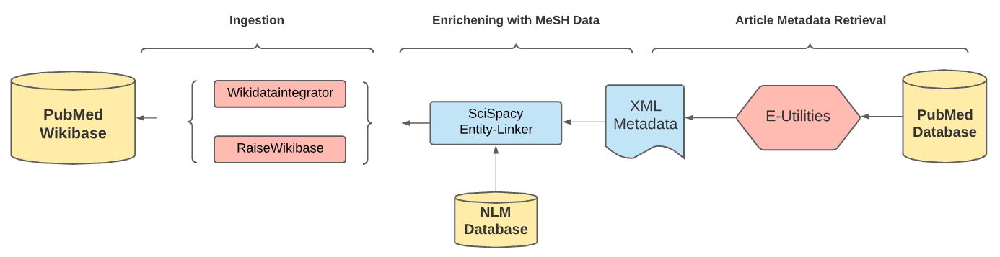

```
Automated creation and filling of a new wikibase instance with PubMed metadata and MeSH terms.
```
* Automated inserts into a fresh [Raise-Wikibase](https://github.com/UB-Mannheim/RaiseWikibase) instance
* Scripts for automated property and item creation given a queryterm
* Scripts tested in a Windows system within a Ubuntu 20.04 terminal with Python 3.9.2

## Table of contents
- [Table of contents](#table-of-contents)
- [Overview](#overview)
- [How to use](#how-to-use)
  - [Installation](#installation)
  - [Customizing Wikibase](#customizing-wikibase)
- [Important Scripts](#important-scripts)
  - [Systems.py](#systemspy)
  - [Wikibase Log-in](#wikibase-log-in)
  - [Creating Properties](#creating-properties)
  - [Data Retrieval](#data-retrieval)
  - [Creating MeSH Items](#creating-mesh-items)
  - [Creating PubMed Items](#creating-pubmed-items)
- [Useful Docker Commands](#useful-docker-commands)
  - [Creating Backups](#creating-backups)
- [Sources](#sources)
- [Acknowledgements](#acknowledgements)
- [Further Research](#further-research)
- [TODO for Documentation](#todo-for-documentation)

## Overview
A Repository that specializes itself in creating a fresh Wikibase instance filled with relevant PubMed metadata and MeSH Headings from the NLM Database.


## Knowledge Graph Structure
> - Knowledge graph based on Wikibase, based on 2 types of entities
> - First Entity is the Pubmed Article Entity
> - Second Entity is Mesh Entities (contain relevant information such as the Mesh Heading, Mesh Id, Mesh URL and Scope Node)
> - The 2 entities are symatically connected to each other via the mesh ID


## How to use

### Installation
```
- Install & Enable WSL2
- Install Docker
- For Windows: Install Ubuntu Terminal & Windows Terminal from Windows Store & relevant libraries
    - https://codefellows.github.io/setup-guide/
- Create Directory
- git clone https://github.com/UB-Mannheim/RaiseWikibase
cd RaiseWikibase/
sudo apt install default-libmysqlclient-dev
pip3 install -e .
- env.tmpl > rename to '.env' and insert usernames/password
    - passwords must be at least 10 characters long!
    - [WB_DB_USER], [WB_DB_NAME], [WB_ADMIN_USER] must be capitalized or ideally full cap in order to avoid db connection errors
pip3 install -r requirements.txt
- docker-compose up -d
```
### Customizing Wikibase
```
## Making Changes
- LocalSettings.php.template
## Extensions
- Download Extension in ./RaiseWikibase/extensions
- Add Volume to docker-ompose.yml
    - ./extensions/TemplateStyles:/var/www/html/extensions/TemplateStyles
- Add Volume to LocalSettings.php.template
    -wfLoadExtension( 'TemplateStyles' );
    ${DOLLAR}wgTidyConfig = [
        'driver' => 'RaggettInternalPHP',
        'tidyConfigFile' => "${DOLLAR}IP/includes/tidy/tidy.conf",
    ];
```
## Important Scripts

### Systems.py
>Mainscript that executes all important scripts to sucessfully fill the Wikibase instance:  
>[systems.py](https://github.com/AH-Tran/ID_Wikibase/blob/main/scripts/create_properties.py)
```python
#Import Main Scripts
import create_properties 
import data_retrieval
import create_mesh_items
import create_items_wd

retmaximum = 10
queryterm ='infectious diseases'

# Execute scripts
create_properties.first_property_setup()
metadata = data_retrieval.main(retmaximum, queryterm)
create_mesh_items.main('meshtermlist.csv')
create_items_wd.main(metadata)
```
### Wikibase Log-in
>Creates a Bot, saves the credentials in config.json and uses those credentials to log into the Wikibase Instance
```python
def wikibase_login():
    ## Create Bot and save credentials in .config.json
    create_bot()
    config = Settings()

    ## Connect to Wikibase Instance and login with credentials
    wdi_config['MEDIAWIKI_API_URL'] = config.mediawiki_api_url
    wdi_config['SPARQL_ENDPOINT_URL'] = config.sparql_endpoint_url
    wdi_config['WIKIBASE_URL'] = config.wikibase_url
    
    #The config dictionary can be used in WikibaseIntegrator for creating a login instance:
    login_instance = wdi_login.WDLogin(user=config.username, pwd=config.password)
```

### Creating Properties
>Automatically allows the user to create user-defined properties in the Wikibase instance. Allows you to both extract **properties directly from WikiData** and create **custom properties**:  
>[create_properties.py](https://github.com/AH-Tran/ID_Wikibase/blob/main/scripts/create_properties.py)
```python
# Extract Properties from WD(WikiData) and insert them into the Wikibase instance
p1 = property_wd('P932') #PBMCID
p2 = property_wd('P698') #pubmed id
batch('wikibase-property', [p1, p2])

#Create custom MeSH relevant properties
p27 = create_property('MeSH Heading', ['Heading'], 'Label of the MeSH descriptor ID', 'string')
p28 = create_property('ScopeNote', ['Note'], 'Note describing further the Label of a MeSH Heading', 'string')
p29 = create_property('MeshBrowserLink', ['Mesh URL', 'MeSH Browser'], 'MeSH Browser URL of a specific Mesh Heading', 'url')
p30 = create_property('MeSH Treecode', ['Tree', 'MeSH Tree'], 'MeSH Tree Code of a specific Mesh Heading', 'string')
batch('wikibase-property', [p27, p28, p29, p30])
```
### Data Retrieval
>Automatically creates a csv-file with all used MeSHTerms,their description and tree number and a list of all articles found to the queryterm:  
>[data_retrieval.py](https://github.com/AH-Tran/ID_Wikibase/blob/main/scripts/data_retrieval.py)
```python
urllist = df['MeSHBrowserLink'].tolist()
for i in urllist:
    n = i
    start = time.time()
    driver = webdriver.Chrome(chrome_options=options)
    driver.get(i)
    time.sleep(3)
    element = driver.find_elements_by_xpath('//a[contains(@id,"treeNumber_")]')
    elementlist = []
    for i in element:
        elementlist.append(i.text)
    TNlist.append(elementlist)
    end = time.time()
    timelist.append(end-start)
df['TreeNumbers'] = TNlist
df.to_csv('meshtermlist.csv')
return dicts
```

### Creating MeSH Items
>Automatically creates MeSH items with retrieved metadata:  
>[create_items_wd.py](https://github.com/AH-Tran/ID_Wikibase/blob/main/scripts/create_mesh_items.py)
```python
def upload_data(login_instance, config, meshtermlist):
    # Load excel table to load into Wikibase
    mydata = pd.read_csv(meshtermlist)
    for index, row in mydata.iterrows():
        ## Prepare the statements to be added
        item_statements = [] # all statements for one item
        item_statements.append(wdi_core.WDString(mydata.loc[index].at['MeSH Unique ID'], prop_nr="P26")) #MeSH Unique ID 
        item_statements.append(wdi_core.WDString(mydata.loc[index].at['MeSH Heading'], prop_nr="P27")) #MeSH Heading 
        item_statements.append(wdi_core.WDUrl(mydata.loc[index].at['MeSHBrowserLink'], prop_nr="P29")) #MeSH URL

        ## instantiate the Wikibase page, add statements, labels and descriptions
        wbPage = wdi_core.WDItemEngine(data=item_statements, mediawiki_api_url=config.wikibase_url + "/w/api.php")
        wbPage.set_label(mydata.loc[index].at['MeSH Heading'], lang="en")
        wbPage.set_description("MeSH Entity extracted from NLM", lang="en")

        ## sanity check (debug)
        pprint.pprint(wbPage.get_wd_json_representation())

        ## write data to wikibase
        wbPage.write(login_instance)
```

### Creating PubMed Items
>Automatically creates PubMed article items with retrieved metadata:  
>[create_items_wd.py](https://github.com/AH-Tran/ID_Wikibase/blob/main/scripts/create_items_wd.py)
```python
def upload_data(login_instance, config):
    # load excel table to load into Wikibase
    mydata = pd.read_csv("pubmed_data.csv")
    for index, row in mydata.iterrows():
        ## Prepare the statements to be added
        item_statements = [] # all statements for one item
        item_statements.append(wdi_core.WDString(mydata.loc[index].at['PubmedArticle_MedlineCitation_Article_ArticleTitle'], prop_nr="P11")) #title 
        item_statements.append(wdi_core.WDString(mydata.loc[index].at['PubmedArticle_MedlineCitation_Article_AuthorList_Author_LastName'], prop_nr="P12")) #author

        ## instantiate the Wikibase page, add statements, labels and descriptions
        wbPage = wdi_core.WDItemEngine(data=item_statements, mediawiki_api_url=config.wikibase_url + "/w/api.php")
        wbPage.set_label(mydata.loc[index].at['PubmedArticle_MedlineCitation_Article_ArticleTitle'], lang="en")
        wbPage.set_description("Article retrieved from PubMed", lang="en")

        ## sanity check (debug)
        pprint.pprint(wbPage.get_wd_json_representation())

        ## write data to wikibase
        wbPage.write(login_instance)
```

## Useful Docker Commands
> Following Docker Commands can be of use when customizing and editing the Wikibase instance.
```
### Stop Wikibase Docker
docker-compose down
### Remove uploaded Data & run fresh Wikibase Instance
sudo rm -rf mediawiki-*  query-service-data/ quickstatements-data/
docker-compose up -d
### Reload a single service (example: wikibase) to adopt new changes in settings
docker-compose up --no-deps -d wikibase
```

### Creating Backups
> Volume Backups can bve made through these commands.
```
- Take snapshots of: docker-compose file, mounted files
### Volume backup
- docker run -v wikibase-registry_mediawiki-mysql-data:/volume -v /root/volumeBackups:/backup --rm loomchild/volume-backup backup mediawiki-mysql-data_20190129
- docker run -v wikibase-registry_mediawiki-images-data:/volume -v /root/volumeBackups:/backup --rm loomchild/volume-backup backup mediawiki-images-data_20190129
- docker run -v wikibase-registry_query-service-data:/volume -v /root/volumeBackups:/backup --rm loomchild/volume-backup backup query-service-data_20190129
```

## Sources
- [PubMed](https://pubmed.ncbi.nlm.nih.gov/)
- [MeSH Browser](https://meshb.nlm.nih.gov/search)
- [Wikidata](https://www.wikidata.org/wiki/Wikidata:Main_Page)
- [Raise-Wikibase](https://github.com/UB-Mannheim/RaiseWikibase)

## Acknowledgements

## Further Research
- Dynamically Adapt Property Creation with CSV 
- Support for different formats than CSV
- Extract MeSH Entities from Wikidata
- Enter Wikibase into Wikibase Registry
- Authenticate Author Entity with either Scholia or 
- Document new encountered Limits
- IR/NLP metrics on Abstracts
- MeSH Tree Hierarchy as Knowledge Graph Structure
- Accuracy on Enrichening Process
## TODO for Documentation
- Knowledge Graph Structure with example Screenshots
- Data Retrieval Examples
- MeSH Examples
